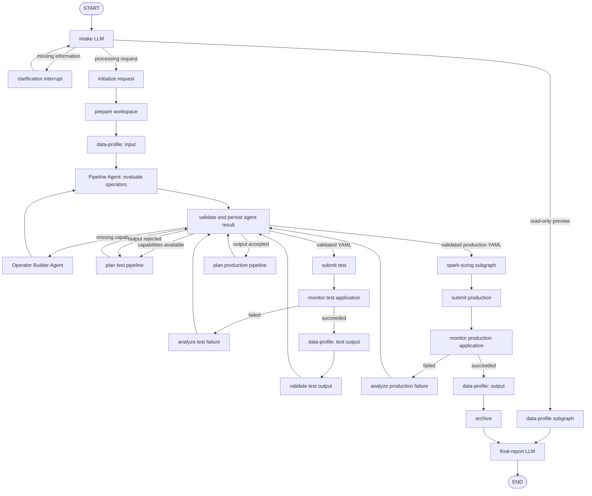

# data-refiner-agent

[English](README.md) | [中文](README_CN.md)

Data Refiner Agent is a standalone project that can be deployed and run independently.
Its Pipeline Agent and Operator Builder Agent are isolated Deep/ReAct agents. Explicit
graph nodes own data profiling, Spark configuration, application monitoring, state
transitions, and side effects.

## Relationship with data-refiner

This project and
[`data-refiner`](https://github.com/Sonder0731/data-refiner) are independently
maintained companion repositories that depend on each other at the product level.
`data-refiner-agent` installs `data-refiner-pyspark` and relies on its Spark operators
and pipeline runtime. In the complete automated workflow, `data-refiner` relies on this
Agent project for natural-language task understanding, pipeline planning, missing
operator construction, job submission, and monitoring. Together they provide the full
agent-driven data refinement system while remaining independently versioned and
released.

## Quick start

Requirements: Linux, Docker Engine, Docker Compose v2, and at least 20 GB of free disk
space. Configure the model first:

```bash
cp .env.example .env
# Edit .env and set OPENAI_API_KEY. Also set LITELLM_API_KEY when using LiteLLM.
```

Build the images, start the full stack, and initialize Hive and HDFS:

```bash
./deploy.sh
```

After deployment, run user requests separately:

```bash
./run.sh "Inspect the fields and sample records in hdfs:///data/chinese_news"
```

`run.sh` creates a disposable Agent container for one request. It does not rebuild
images, restart the infrastructure, or rerun bootstrap.

Hadoop, Hive, and Spark are built from a pinned commit of
[`Sonder0731/hadoop-hive-spark-docker`](https://github.com/Sonder0731/hadoop-hive-spark-docker).
Its source is not copied into this repository.
[`data-refiner`](https://github.com/Sonder0731/data-refiner) is installed through its
PyPI distribution, `data-refiner-pyspark==1.0.0`.

## Uninstall

The following commands permanently remove this project's containers, networks,
HDFS/PostgreSQL volumes, and related images:

```bash
docker compose --env-file .env --env-file .runtime.env --profile '*' down \
  --volumes --remove-orphans --rmi all
docker image rm hadoop-hive-spark-master hadoop-hive-spark-base 2>/dev/null || true
```

These commands do not delete the repository, `.env`, or `.runtime.env` files.

## Repository layout

| Path | Purpose |
| --- | --- |
| `src/` | Agent and tool clients |
| `services/data-refiner-api/` | Data Refiner API running in the Hadoop master container |
| `services/data-refiner-user-workspace/` | Per-user operator development and Spark runtime |
| `services/docker-container-api/` | API-key-protected workspace container management |
| `services/embedding/` | Dataset retrieval embedding service |
| `services/spark-monitor/` | YARN and Spark application monitoring |
| `deploy/` | Hadoop master extension and Hive/HDFS bootstrap |
| `compose.yaml` | Complete runtime topology |
| `deploy.sh` | Build, startup, and initialization entry point |
| `run.sh` | User request entry point |

`data-refiner` and `hadoop-hive-spark-docker` remain external releases and are not
vendored into this repository.

## Bootstrap

Every `deploy.sh` run idempotently ensures that Hive contains:

| Database | Location |
| --- | --- |
| `default` | `hdfs:///user/hive/warehouse` |
| `temp` | `hdfs:///user/hive/warehouse/temp.db` |

HDFS is initialized with:

| HDFS directory | File |
| --- | --- |
| `/data/cc` | `000_00000.parquet` |
| `/data/chinese_news` | `chinese_news.csv` |
| `/data/douban_movies` | `DMSC.csv` |
| `/data/btc_ohlcv_dataset` | `btcusd_1-min_data.csv` |
| `/data/job_postings` | `postings.csv` |

Bootstrap verifies each file's size and SHA-256 checksum. It fails when an existing
file differs, avoiding replacement of unknown data. Missing files are downloaded from
Hugging Face, verified in a temporary HDFS location, and moved atomically. Bootstrap
also installs `run_cluster_args.py` and the GraphFrames JAR required for Spark jobs.
The Hive `temp` database stores `temp.data_refiner_<request_id>` tables when a request
does not specify an output target.

## Architecture



Both agents are top-level agents created with `subagents=[]`; neither calls the other.

| Agent | Responsibility | Outputs |
| --- | --- | --- |
| `pipeline-agent` | Evaluate operator coverage, write missing-operator instructions, plan test and production YAML, validate test output, and analyze runtime failures | Structured actions, reports, build instructions, or YAML |
| `operator-builder-agent` | Implement one operator from the current instructions, test it, and synchronize its documentation | Build result, paths, test status, and documentation status |

The Pipeline Agent can only read business context and statically validate YAML. The
Operator Builder can only read build context, write operators and tests, run tests,
and synchronize documentation. Neither agent can submit pipelines, mutate business
state, or dispatch another agent.

The main graph owns side effects. It validates each Pipeline Agent action against the
current stage, persists evaluations, build instructions, and YAML, submits Spark jobs,
and advances database state. The Operator Builder can run only when the current stage
is `BUILDING_OPERATOR` and the current operator round has matching evaluation and build
instruction records.

A successful test Spark application is followed by validation of its real schema and
bounded samples against the original request. Production planning starts only after
that validation passes. Test pipelines may be submitted at most three times.

## State

`WorkflowState` stores routing state and references to external artifacts:

| Category | Fields |
| --- | --- |
| Session | `query`, `user_id`, `room_id`, `request_id` |
| Routing | `stage`, `intent`, `clarification_question` |
| Data | `data_type`, `data_source`, `outputs`, `preview_result` |
| Artifact references | `input_metadata_id`, `test_output_metadata_id`, `output_metadata_id`, `operator_evaluation_id`, `operator_build_reference_id`, `spark_runtime_config_id` |
| Agent loop | `operator_round`, `pipeline_agent_result`, `pipeline_feedback`, `pipeline_feedback_history`, `pipeline_revision` |
| Spark runs | `test_run`, `production_run` |
| Monitoring and failure | `monitor_outcome`, `failure_status`, `error`, `final_answer` |

Each `outputs` item contains a unique logical name, data type, production target, and
isolated test target. `test_run` and `production_run` contain pipeline IDs and paths,
application IDs and status, submission counts, and optional per-operator row metrics.
Full YAML, samples, and operator documentation remain outside the main state.

LangGraph checkpoints support interruption and resumption with the same `thread_id`.
The business database's `request_state` remains the source of truth for persistent
workflow stages, which are advanced through legal transitions and compare-and-swap.

## Local development

Local development requires Python 3.11 and access to the supporting Data Refiner
services:

```bash
cp .env.example .env
uv sync
```

Host-side Agent development requires `OPENAI_API_KEY`, `DATA_REFINER_AGENT_MODEL`, and
`DATABASE_URL`. Workspace creation also requires `DOCKER_CONTAINER_API_KEY`. Override
service locations with `DATA_REFINER_URL`, `DOCKER_CONTAINER_API_URL`,
`EMBEDDING_API_URL`, and `SPARK_MONITOR_URL`.

## Run

`uv run` does not load the repository's `.env` file automatically. Both initial runs
and `--resume` calls must use `--env-file .env` when invoking the CLI directly.

When a processing request does not specify a path or table, the workflow writes to a
unique Hive table named `temp.data_refiner_<request_id>`. These tables are not deleted
automatically. Explicit output targets are used unchanged.

```bash
./run.sh \
  --user-id '@admin:example.test' \
  'Tokenize Movie_Name_CN from hdfs:///data/douban_movies into Movie_Name_CN_Tokens and write the result to hdfs:///data/douban_movies_output_2'
```

Progress is written to `stderr`, and the final answer is written to `stdout`. `--quiet`
prints only the answer; `--debug` prints tracebacks on failure.

If a request needs clarification, the command returns a question and a `thread_id`.
Resume the same graph after providing the answer:

```bash
./run.sh \
  --thread-id '<thread_id from the previous command>' \
  --resume 'Write the result to hdfs:///data/douban_movies_output_2'
```

## Verify

```bash
uv run ruff check .
uv run pytest
```

Database integration tests are skipped by default. Set `DATABASE_INTEGRATION_TEST=1`
and `DATABASE_URL` when running them against a dedicated test database.
