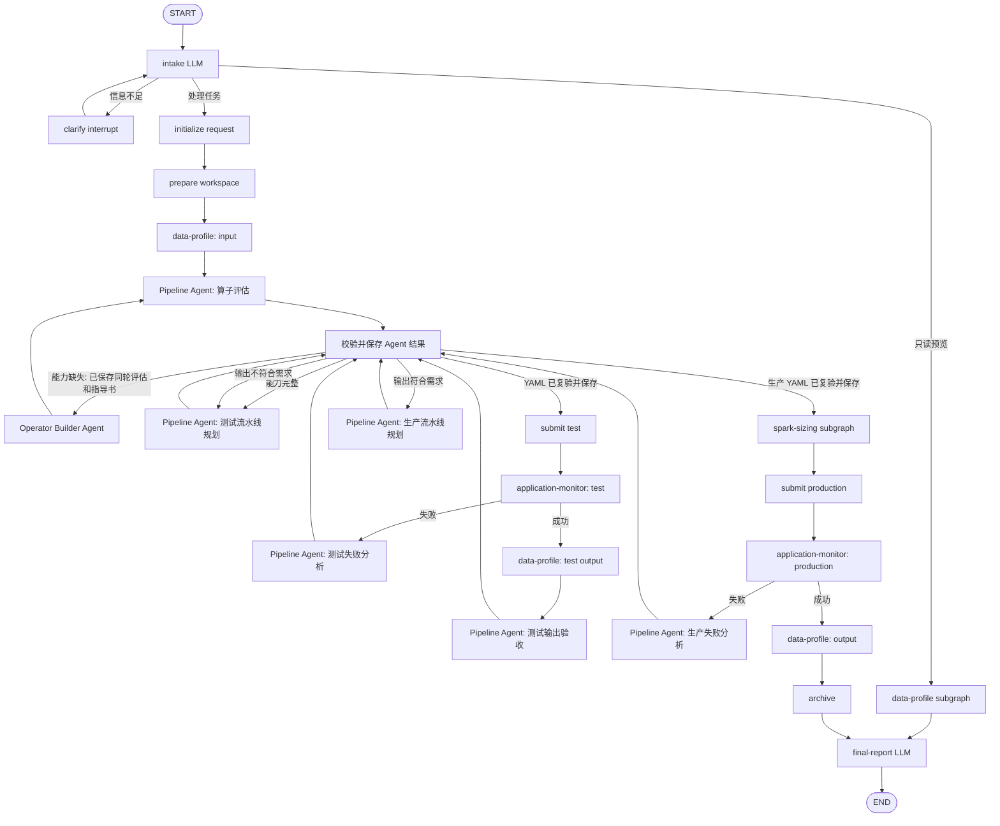

# data-refiner-agent

[English](README.md) | [中文](README_CN.md)

一个可独立部署和运行的 Data Refiner Agent 项目。Pipeline Agent 和 Operator Builder
Agent 是两个互相隔离的 Deep/ReAct Agent；数据概况、Spark 配置、应用监控以及所有
状态迁移和副作用由显式图节点完成。

## 与 data-refiner 的关系

本项目与 [`data-refiner`](https://github.com/Sonder0731/data-refiner) 是两个独立维护、
在产品层面相互依赖的配套仓库。`data-refiner-agent` 安装
`data-refiner-pyspark`，依赖其 Spark 算子和流水线运行时；在完整自动化工作流中，
`data-refiner` 依赖本 Agent 项目提供自然语言任务理解、流水线规划、缺失算子构建、
任务提交和运行监控能力。两者共同组成完整的 Agent 驱动数据处理系统，同时保持独立
版本和独立发布。

## 快速开始

要求 Linux、Docker Engine、Docker Compose v2，以及至少 20 GB 可用磁盘。先配置模型：

```bash
cp .env.example .env
# 编辑 .env，填写 OPENAI_API_KEY；使用 LiteLLM 时同时填写 LITELLM_API_KEY。
```

部署镜像、启动完整服务并初始化 Hive/HDFS：

```bash
./deploy.sh
```

部署完成后，单独执行请求：

```bash
./run.sh "分析 hdfs:///data/chinese_news 的字段和样例"
```

`run.sh` 只创建一次性 Agent 容器，不会重新构建镜像、启动基础服务或运行 bootstrap。

Hadoop/Hive/Spark 从
[`Sonder0731/hadoop-hive-spark-docker`](https://github.com/Sonder0731/hadoop-hive-spark-docker)
的固定提交构建，不复制其源码。
[`data-refiner`](https://github.com/Sonder0731/data-refiner) 通过 PyPI 包
`data-refiner-pyspark==1.0.0` 安装。

## 仓库结构

| 路径 | 内容 |
| --- | --- |
| `src/` | Agent 与工具客户端 |
| `services/data-refiner-api/` | 运行在 Hadoop master 容器中的 Data Refiner API |
| `services/data-refiner-user-workspace/` | 按用户动态创建的算子开发与 Spark 运行环境 |
| `services/docker-container-api/` | 受 API key 保护的工作区容器管理服务 |
| `services/embedding/` | 数据集检索向量服务 |
| `services/spark-monitor/` | YARN/Spark 任务状态与日志服务 |
| `deploy/` | master 扩展层及 Hive/HDFS bootstrap |
| `compose.yaml` | 完整运行拓扑 |
| `deploy.sh` | 构建、启动和初始化入口 |
| `run.sh` | 用户请求执行入口 |

`data-refiner` 和 `hadoop-hive-spark-docker` 都保持为外部发布物，不纳入本仓源码。

## 卸载

以下命令会永久删除本项目的容器、网络、HDFS/PostgreSQL 持久卷和相关镜像：

```bash
docker compose --env-file .env --env-file .runtime.env --profile '*' down \
  --volumes --remove-orphans --rmi all
docker image rm hadoop-hive-spark-master hadoop-hive-spark-base 2>/dev/null || true
```

命令不会删除代码仓、`.env` 或 `.runtime.env` 文件。

## 初始化

每次执行 `deploy.sh` 都会幂等确认 Hive 中存在：

| 数据库 | Location |
| --- | --- |
| `default` | `hdfs:///user/hive/warehouse` |
| `temp` | `hdfs:///user/hive/warehouse/temp.db` |

HDFS 会包含以下默认数据：

| HDFS 目录 | 文件 |
| --- | --- |
| `/data/cc` | `000_00000.parquet` |
| `/data/chinese_news` | `chinese_news.csv` |
| `/data/douban_movies` | `DMSC.csv` |
| `/data/btc_ohlcv_dataset` | `btcusd_1-min_data.csv` |
| `/data/job_postings` | `postings.csv` |

bootstrap 会核对文件大小和 SHA-256。已有文件不一致时直接失败，避免覆盖未知数据；缺失
文件才从 Hugging Face 下载，并以 HDFS 临时文件校验后原子移动到目标路径。它还会安装
Spark 提交需要的 `run_cluster_args.py` 和 GraphFrames JAR。Hive `temp` 数据库用于未显式
指定输出时生成的 `temp.data_refiner_<request_id>` 表。

## 架构



两个 Agent 都是主 Agent，均以 `subagents=[]` 创建，不会相互调用：

| Agent | 职责 | 可产生的业务结果 |
| --- | --- | --- |
| `pipeline-agent` | 算子能力评估、缺失算子指导书、测试/生产 YAML、测试输出验收、运行失败语义分析 | 结构化动作、报告、指导书或 YAML |
| `operator-builder-agent` | 按当前轮指导书实现一个算子、测试并同步文档 | 构建结果、路径、测试和文档状态 |

Pipeline Agent 只有读取业务上下文和静态校验 YAML 的工具。Operator Builder 只有读取
构建上下文、写算子/测试、执行测试和同步文档的工具。两者都没有流水线提交、数据库
状态迁移或 Agent 派发工具。

主图是副作用边界：它复验 Pipeline Agent 的动作与当前阶段是否匹配，保存算子评估、
指导书和 YAML，提交 Spark 任务并迁移数据库阶段。进入 Operator Builder 前必须同时
满足以下条件：

1. 当前阶段为 `BUILDING_OPERATOR`。
2. 当前 `operator_round` 的算子评估存在且 ID 与主状态一致。
3. 同一轮算子构建指导书存在、内容非空且 ID 与主状态一致。

因此，测试运行发现新算子缺口时，流程一定先保存新一轮评估报告和指导书，再调用
Operator Builder；历史轮次的“最新指导书”不能替代当前轮指导书。

测试 Spark 应用成功只表示执行成功。主图随后读取独立测试目标的真实 schema 和有界
样例，由 Pipeline Agent 对照原始用户请求验收；不符合时将具体反馈送回测试流水线规划，
重新提交并再次验收。只有验收通过才能规划生产，测试提交最多三次。

## 状态

主图 `WorkflowState` 保存跨节点路由和外部产物引用：

| 分类 | 字段 |
| --- | --- |
| 会话 | `query`, `user_id`, `room_id`, `request_id` |
| 路由 | `stage`, `intent`, `clarification_question` |
| 数据 | `data_type`, `data_source`, `outputs`, `preview_result` |
| 产物引用 | `input_metadata_id`, `test_output_metadata_id`, `output_metadata_id`, `operator_evaluation_id`, `operator_build_reference_id`, `spark_runtime_config_id` |
| Agent 循环 | `operator_round`, `pipeline_agent_result`, `pipeline_feedback`, `pipeline_feedback_history`, `pipeline_revision` |
| Spark 运行 | `test_run`, `production_run` |
| 监控/失败 | `monitor_outcome`, `failure_status`, `error`, `final_answer` |

`outputs` 中每个元素保存唯一逻辑名称、数据类型、正式目标和隔离测试目标。`test_run` 和
`production_run` 保存 pipeline ID/path、application ID/status、提交次数和各算子的可选
行数指标。完整 YAML、数据样例和算子文档不进入主状态。

Agent 的运行上下文由主图创建，通过 `ToolRuntime` 注入，模型不需要也不能在工具参数
中填写这些身份字段：

| 上下文 | 字段 |
| --- | --- |
| `PipelineAgentContext` | `user_id`, `request_id`, `task`, `operator_round`, `pipeline_category`, `application_id`, `failure_status`, `validation_feedback`, `outputs` |
| `OperatorBuilderContext` | `user_id`, `request_id`, `operator_round`, `build_reference_id` |

三个子图只承担边界清晰的步骤：

| 子图 | 确定性节点 | 结构化 LLM 节点 | 私有状态 |
| --- | --- | --- | --- |
| `data-profile` | 逐个读取输出并保存聚合元数据 | 整理 schema/样例为概况 | `raw_profile`, `profile_description`, `profile_error` |
| `spark-sizing` | 读取资源、校验上限、保存参数 | 生成或修复 Spark 参数 | `sizing_context`, `cluster_resources`, `runtime_args`, `sizing_error`, `sizing_attempt` |
| `application-monitor` | 注册并轮询应用、记录终态 | 无 | `monitor_environment`, `monitored_application_id` |

LangGraph checkpointer 负责同一 `thread_id` 的中断与恢复；业务数据库中的
`request_state` 是持久化业务阶段的事实来源，阶段更新继续使用合法转换表和 CAS。

## 本地开发

要求 Python 3.11 和可访问的 Data Refiner 配套服务。

```bash
cp .env.example .env
uv sync
```

直接在宿主机开发 Agent 时，必要配置包括 `OPENAI_API_KEY`、
`DATA_REFINER_AGENT_MODEL`、`DATABASE_URL`；创建工作区时还需要
`DOCKER_CONTAINER_API_KEY`。服务地址可通过
`DATA_REFINER_URL`、`DOCKER_CONTAINER_API_URL`、`EMBEDDING_API_URL` 和
`SPARK_MONITOR_URL` 覆盖。

## 运行

`uv run` 不会默认加载项目根目录的 `.env`，即使当前已经激活虚拟环境。首次运行和使用
`--resume` 恢复工作流时都必须传入 `--env-file .env`，否则程序无法读取
`DATABASE_URL` 等必要配置。

处理请求未指定输出路径或表名时，工作流不会暂停询问，而是将结果写入唯一的 Hive 表
`temp.data_refiner_<request_id>`。该表目前不会自动删除；用户明确指定输出目标时仍按
指定目标写入。

```bash
./run.sh \
  --user-id '@admin:example.test' \
  '对 hdfs:///data/douban_movies 的 Movie_Name_CN 字段进行中文分词，将结果写入 Movie_Name_CN_Tokens，保存到 hdfs:///data/douban_movies_output_2'
```

进度日志输出到 `stderr`，最终回答输出到 `stdout`。`--quiet` 只输出回答，
`--debug` 在失败时打印 traceback。

请求信息不完整时会返回澄清问题和 `thread_id`。回答后恢复同一个图：

```bash
./run.sh \
  --thread-id '<上一次打印的 thread_id>' \
  --resume '保存到 hdfs:///data/douban_movies_output_2'
```

## 验证

```bash
uv run ruff check .
uv run pytest
```

数据库集成测试默认跳过。使用专门测试数据库时设置
`DATABASE_INTEGRATION_TEST=1` 和 `DATABASE_URL`。
